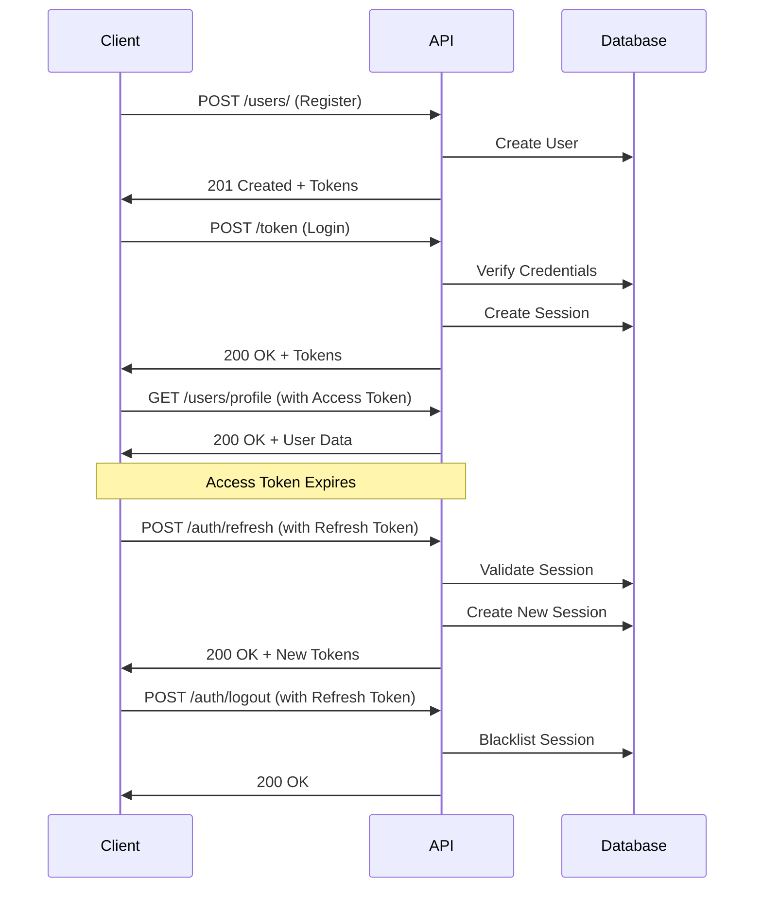

# AI TTRPG API Documentation

## Overview

This API provides comprehensive authentication and character management capabilities for the AI TTRPG application. The system includes advanced security features, session management, and role-based access control.

## Base URL

- **Development**: `http://localhost:8000`
- **Production**: `https://your-domain.com`

## Authentication

The API uses JWT (JSON Web Tokens) with a dual-token system for enhanced security:

- **Access Token**: Short-lived token (15 minutes) for API requests
- **Refresh Token**: Long-lived token (7 days) for obtaining new access tokens

### Authentication Flow



## Security Headers

All API requests should include appropriate headers:

```http
Authorization: Bearer <access_token>
Content-Type: application/json
Accept: application/json
```

## Rate Limiting

The API implements rate limiting to prevent abuse:

- **General endpoints**: 100 requests per minute per IP
- **Authentication endpoints**: 5 requests per minute per IP
- **Password reset**: 3 requests per hour per IP

Rate limit headers are included in responses:
```http
X-RateLimit-Limit: 100
X-RateLimit-Remaining: 95
X-RateLimit-Reset: 1640995200
```

## API Endpoints

### Authentication Endpoints

#### User Registration

**POST** `/users/`

Register a new user account with comprehensive validation.

**Request Body:**
```json
{
  "username": "john_doe",
  "email": "john@example.com",
  "password": "SecurePassword123!"
}
```

**Response:** `201 Created`
```json
{
  "id": 1,
  "username": "john_doe",
  "email": "john@example.com",
  "email_verified": false,
  "is_active": true,
  "failed_login_attempts": 0,
  "locked_until": null,
  "last_login": null,
  "created_at": "2024-01-01T12:00:00Z",
  "updated_at": "2024-01-01T12:00:00Z"
}
```

**Validation Rules:**
- Username: 3-50 characters, alphanumeric and underscores only
- Email: Valid email format, unique
- Password: Minimum 8 characters, must include uppercase, lowercase, number, and special character

**Error Responses:**
- `400 Bad Request`: Validation errors or duplicate username/email
- `422 Unprocessable Entity`: Invalid input format

#### User Login

**POST** `/token`

Authenticate user and receive access and refresh tokens.

**Request Body:** (form-encoded)
```
username=john_doe
password=SecurePassword123!
```

**Response:** `200 OK`
```json
{
  "access_token": "eyJhbGciOiJIUzI1NiIsInR5cCI6IkpXVCJ9...",
  "refresh_token": "550e8400-e29b-41d4-a716-446655440000",
  "token_type": "bearer"
}
```

**Error Responses:**
- `401 Unauthorized`: Invalid credentials or account locked
- `429 Too Many Requests`: Rate limit exceeded

#### Token Refresh

**POST** `/auth/refresh`

Obtain new access and refresh tokens using a valid refresh token.

**Request Body:**
```json
{
  "refresh_token": "550e8400-e29b-41d4-a716-446655440000"
}
```

**Response:** `200 OK`
```json
{
  "access_token": "eyJhbGciOiJIUzI1NiIsInR5cCI6IkpXVCJ9...",
  "refresh_token": "750e8400-e29b-41d4-a716-446655440001",
  "token_type": "bearer"
}
```

**Error Responses:**
- `401 Unauthorized`: Invalid or expired refresh token

#### User Logout

**POST** `/auth/logout`

Invalidate the current refresh token and end the session.

**Headers:**
```http
Authorization: Bearer <access_token>
```

**Request Body:**
```json
{
  "refresh_token": "550e8400-e29b-41d4-a716-446655440000"
}
```

**Response:** `200 OK`
```json
{
  "message": "Successfully logged out"
}
```

#### Password Reset Request

**POST** `/auth/forgot-password`

Request a password reset token via email.

**Request Body:**
```json
{
  "email": "john@example.com"
}
```

**Response:** `200 OK`
```json
{
  "message": "If an account with that email exists, a password reset link has been sent."
}
```

**Note:** The response is always successful to prevent email enumeration attacks.

#### Password Reset Completion

**POST** `/auth/reset-password`

Reset password using a valid reset token.

**Request Body:**
```json
{
  "token": "reset_token_from_email",
  "new_password": "NewSecurePassword123!"
}
```

**Response:** `200 OK`
```json
{
  "message": "Password has been successfully reset. Please log in with your new password."
}
```

**Error Responses:**
- `400 Bad Request`: Invalid token or weak password

### User Profile Endpoints

#### Get User Profile

**GET** `/users/profile`

Retrieve current user's profile information.

**Headers:**
```http
Authorization: Bearer <access_token>
```

**Response:** `200 OK`
```json
{
  "username": "john_doe",
  "email": "john@example.com",
  "email_verified": true,
  "is_active": true,
  "last_login": "2024-01-01T12:00:00Z",
  "created_at": "2024-01-01T10:00:00Z",
  "updated_at": "2024-01-01T12:00:00Z"
}
```

#### Update User Profile

**PATCH** `/users/profile`

Update current user's profile information.

**Headers:**
```http
Authorization: Bearer <access_token>
```

**Request Body:**
```json
{
  "username": "new_username",
  "email": "newemail@example.com"
}
```

**Response:** `200 OK`
```json
{
  "username": "new_username",
  "email": "newemail@example.com",
  "email_verified": false,
  "is_active": true,
  "last_login": "2024-01-01T12:00:00Z",
  "created_at": "2024-01-01T10:00:00Z",
  "updated_at": "2024-01-01T13:00:00Z"
}
```

**Note:** Changing email will reset `email_verified` to `false`.

#### Get Current User

**GET** `/users/me/`

Get complete current user information including internal fields.

**Headers:**
```http
Authorization: Bearer <access_token>
```

**Response:** `200 OK`
```json
{
  "id": 1,
  "username": "john_doe",
  "email": "john@example.com",
  "email_verified": true,
  "is_active": true,
  "failed_login_attempts": 0,
  "locked_until": null,
  "last_login": "2024-01-01T12:00:00Z",
  "created_at": "2024-01-01T10:00:00Z",
  "updated_at": "2024-01-01T12:00:00Z"
}
```

### Utility Endpoints

#### Get Password Policy

**GET** `/auth/password-policy`

Retrieve current password policy requirements.

**Response:** `200 OK`
```json
{
  "min_length": 8,
  "max_length": 128,
  "requirements": {
    "uppercase": true,
    "lowercase": true,
    "numbers": true,
    "special_chars": true
  },
  "restrictions": {
    "no_username": true,
    "no_email": true,
    "no_common_words": true,
    "no_sequential": true
  }
}
```

#### Session Cleanup (Admin)

**POST** `/auth/cleanup-sessions`

Administrative endpoint to clean up expired sessions.

**Response:** `200 OK`
```json
{
  "message": "Cleaned up 15 expired sessions"
}
```

## Character Management Endpoints

### Character CRUD Operations

#### List Characters

**GET** `/characters/`

Retrieve user's characters with optional filtering.

**Headers:**
```http
Authorization: Bearer <access_token>
```

**Query Parameters:**
- `skip`: Number of records to skip (default: 0)
- `limit`: Maximum number of records (default: 100)
- `is_template`: Filter by template status (boolean)
- `is_public`: Filter by public status (boolean)

**Response:** `200 OK`
```json
[
  {
    "id": 1,
    "name": "Aragorn",
    "character_class": "Ranger",
    "level": 5,
    "strength": 16,
    "dexterity": 14,
    "intelligence": 12,
    "charisma": 13,
    "is_template": false,
    "is_public": false,
    "version": 1,
    "experience_points": 5000,
    "character_level": 5,
    "created_at": "2024-01-01T10:00:00Z",
    "updated_at": "2024-01-01T12:00:00Z"
  }
]
```

#### Create Character

**POST** `/characters/`

Create a new character with validation.

**Headers:**
```http
Authorization: Bearer <access_token>
```

**Request Body:**
```json
{
  "name": "Legolas",
  "character_class": "Ranger",
  "level": 1,
  "strength": 12,
  "dexterity": 18,
  "intelligence": 14,
  "charisma": 13,
  "is_template": false,
  "is_public": false
}
```

**Response:** `201 Created`
```json
{
  "id": 2,
  "name": "Legolas",
  "character_class": "Ranger",
  "level": 1,
  "strength": 12,
  "dexterity": 18,
  "intelligence": 14,
  "charisma": 13,
  "is_template": false,
  "is_public": false,
  "version": 1,
  "experience_points": 0,
  "character_level": 1,
  "user_id": 1,
  "created_at": "2024-01-01T14:00:00Z",
  "updated_at": "2024-01-01T14:00:00Z"
}
```

#### Get Character

**GET** `/characters/{character_id}`

Retrieve a specific character by ID.

**Headers:**
```http
Authorization: Bearer <access_token>
```

**Response:** `200 OK`
```json
{
  "id": 1,
  "name": "Aragorn",
  "character_class": "Ranger",
  "level": 5,
  "strength": 16,
  "dexterity": 14,
  "intelligence": 12,
  "charisma": 13,
  "is_template": false,
  "is_public": false,
  "version": 1,
  "experience_points": 5000,
  "character_level": 5,
  "user_id": 1,
  "created_at": "2024-01-01T10:00:00Z",
  "updated_at": "2024-01-01T12:00:00Z"
}
```

**Error Responses:**
- `404 Not Found`: Character doesn't exist or access denied

#### Update Character

**PUT** `/characters/{character_id}`

Update an existing character with validation.

**Headers:**
```http
Authorization: Bearer <access_token>
```

**Request Body:**
```json
{
  "name": "Aragorn the King",
  "character_class": "Ranger",
  "level": 6,
  "strength": 17,
  "dexterity": 14,
  "intelligence": 12,
  "charisma": 14,
  "experience_points": 6000
}
```

**Response:** `200 OK`
```json
{
  "id": 1,
  "name": "Aragorn the King",
  "character_class": "Ranger",
  "level": 6,
  "strength": 17,
  "dexterity": 14,
  "intelligence": 12,
  "charisma": 14,
  "is_template": false,
  "is_public": false,
  "version": 2,
  "experience_points": 6000,
  "character_level": 6,
  "user_id": 1,
  "created_at": "2024-01-01T10:00:00Z",
  "updated_at": "2024-01-01T15:00:00Z"
}
```

#### Delete Character

**DELETE** `/characters/{character_id}`

Delete a character (user must own the character).

**Headers:**
```http
Authorization: Bearer <access_token>
```

**Response:** `204 No Content`

### Advanced Character Features

#### Character Search

**GET** `/characters/search`

Search characters with advanced filtering.

**Headers:**
```http
Authorization: Bearer <access_token>
```

**Query Parameters:**
- `name`: Character name (partial match)
- `character_class`: Exact class match
- `min_level`: Minimum level
- `max_level`: Maximum level
- `is_public`: Public characters only
- `is_template`: Templates only

**Response:** `200 OK`
```json
[
  {
    "id": 1,
    "name": "Aragorn",
    "character_class": "Ranger",
    "level": 5,
    "is_template": false,
    "is_public": true,
    "owner": "john_doe"
  }
]
```

#### Character Templates

**GET** `/characters/templates`

Get available character templates.

**Headers:**
```http
Authorization: Bearer <access_token>
```

**Response:** `200 OK`
```json
[
  {
    "id": 10,
    "name": "Basic Fighter Template",
    "character_class": "Fighter",
    "level": 1,
    "strength": 16,
    "dexterity": 12,
    "intelligence": 10,
    "charisma": 12,
    "is_template": true,
    "is_public": true,
    "description": "A basic fighter template for new players"
  }
]
```

#### Character Versioning

**GET** `/characters/{character_id}/versions`

Get version history for a character.

**Headers:**
```http
Authorization: Bearer <access_token>
```

**Response:** `200 OK`
```json
[
  {
    "version": 2,
    "changes": "Leveled up, increased strength",
    "created_at": "2024-01-01T15:00:00Z"
  },
  {
    "version": 1,
    "changes": "Initial character creation",
    "created_at": "2024-01-01T10:00:00Z"
  }
]
```

**POST** `/characters/{character_id}/snapshot`

Create a version snapshot of the character.

**Headers:**
```http
Authorization: Bearer <access_token>
```

**Request Body:**
```json
{
  "notes": "Before major quest"
}
```

**Response:** `201 Created`
```json
{
  "version": 3,
  "character_id": 1,
  "snapshot_data": {...},
  "notes": "Before major quest",
  "created_at": "2024-01-01T16:00:00Z"
}
```

#### Character Import/Export

**GET** `/characters/{character_id}/export`

Export character data as JSON.

**Headers:**
```http
Authorization: Bearer <access_token>
```

**Response:** `200 OK`
```json
{
  "character": {
    "name": "Aragorn",
    "character_class": "Ranger",
    "level": 5,
    "stats": {...},
    "equipment": [...],
    "skills": [...]
  },
  "metadata": {
    "export_date": "2024-01-01T16:00:00Z",
    "version": 2,
    "format_version": "1.0"
  }
}
```

**POST** `/characters/import`

Import character data from JSON.

**Headers:**
```http
Authorization: Bearer <access_token>
```

**Request Body:**
```json
{
  "character_data": {
    "name": "Imported Character",
    "character_class": "Wizard",
    "level": 3,
    "strength": 8,
    "dexterity": 12,
    "intelligence": 18,
    "charisma": 14
  }
}
```

**Response:** `201 Created`
```json
{
  "id": 15,
  "name": "Imported Character",
  "character_class": "Wizard",
  "level": 3,
  "imported": true,
  "created_at": "2024-01-01T16:30:00Z"
}
```

## Error Handling

The API uses standard HTTP status codes and provides detailed error information:

### Error Response Format

```json
{
  "detail": "Error description",
  "error_code": "VALIDATION_ERROR",
  "request_id": "req_123456789",
  "timestamp": "2024-01-01T12:00:00Z",
  "path": "/users/profile",
  "suggestions": ["Check your input", "Try again later"]
}
```

### Common HTTP Status Codes

- **200 OK**: Request successful
- **201 Created**: Resource created successfully
- **204 No Content**: Request successful, no content returned
- **400 Bad Request**: Invalid request data
- **401 Unauthorized**: Authentication required or failed
- **403 Forbidden**: Access denied
- **404 Not Found**: Resource not found
- **422 Unprocessable Entity**: Validation errors
- **429 Too Many Requests**: Rate limit exceeded
- **500 Internal Server Error**: Server error

### Authentication Errors

```json
{
  "detail": "Could not validate credentials",
  "error_code": "INVALID_TOKEN",
  "request_id": "req_123456789"
}
```

### Validation Errors

```json
{
  "detail": "Validation error",
  "error_code": "VALIDATION_ERROR",
  "errors": [
    {
      "field": "password",
      "message": "Password must contain at least one uppercase letter"
    }
  ]
}
```

## Security Features

### Account Security

- **Account Lockout**: Accounts are temporarily locked after 5 failed login attempts
- **Password Policies**: Enforced complexity requirements
- **Session Management**: Automatic cleanup of expired sessions
- **Audit Logging**: Security events are logged for monitoring

### Data Protection

- **Input Validation**: All inputs are validated and sanitized
- **SQL Injection Protection**: Parameterized queries prevent SQL injection
- **XSS Prevention**: Output encoding prevents cross-site scripting
- **CSRF Protection**: Cross-site request forgery protection

### Token Security

- **JWT Signing**: Tokens are cryptographically signed
- **Token Rotation**: Refresh tokens are rotated on use
- **Token Blacklisting**: Compromised tokens can be blacklisted
- **Short Expiration**: Access tokens have short lifespans

## Rate Limiting

### Limits by Endpoint Type

| Endpoint Category | Limit | Window |
|------------------|-------|---------|
| General API | 100 requests | 1 minute |
| Authentication | 5 requests | 1 minute |
| Password Reset | 3 requests | 1 hour |
| Character Operations | 50 requests | 1 minute |

### Rate Limit Headers

```http
X-RateLimit-Limit: 100
X-RateLimit-Remaining: 95
X-RateLimit-Reset: 1640995200
X-RateLimit-Window: 60
```

### Rate Limit Response

When rate limited, the API returns:

```http
HTTP/1.1 429 Too Many Requests
```

```json
{
  "detail": "Rate limit exceeded",
  "error_code": "RATE_LIMIT_EXCEEDED",
  "retry_after": 60,
  "limit": 100,
  "window": 60
}
```

## SDK Examples

### JavaScript/TypeScript

```typescript
class AITTRPGClient {
  private baseURL: string;
  private accessToken: string | null = null;
  private refreshToken: string | null = null;

  constructor(baseURL: string) {
    this.baseURL = baseURL;
  }

  async register(username: string, email: string, password: string) {
    const response = await fetch(`${this.baseURL}/users/`, {
      method: 'POST',
      headers: { 'Content-Type': 'application/json' },
      body: JSON.stringify({ username, email, password })
    });
    
    if (!response.ok) {
      throw new Error(`Registration failed: ${response.statusText}`);
    }
    
    return response.json();
  }

  async login(username: string, password: string) {
    const response = await fetch(`${this.baseURL}/token`, {
      method: 'POST',
      headers: { 'Content-Type': 'application/x-www-form-urlencoded' },
      body: `username=${username}&password=${password}`
    });
    
    if (!response.ok) {
      throw new Error(`Login failed: ${response.statusText}`);
    }
    
    const data = await response.json();
    this.accessToken = data.access_token;
    this.refreshToken = data.refresh_token;
    
    return data;
  }

  async getProfile() {
    const response = await this.authenticatedRequest('/users/profile');
    return response.json();
  }

  async createCharacter(characterData: any) {
    const response = await this.authenticatedRequest('/characters/', {
      method: 'POST',
      body: JSON.stringify(characterData)
    });
    return response.json();
  }

  private async authenticatedRequest(path: string, options: RequestInit = {}) {
    if (!this.accessToken) {
      throw new Error('Not authenticated');
    }

    const response = await fetch(`${this.baseURL}${path}`, {
      ...options,
      headers: {
        'Authorization': `Bearer ${this.accessToken}`,
        'Content-Type': 'application/json',
        ...options.headers
      }
    });

    if (response.status === 401) {
      // Try to refresh token
      await this.refreshAccessToken();
      // Retry request
      return this.authenticatedRequest(path, options);
    }

    return response;
  }

  private async refreshAccessToken() {
    if (!this.refreshToken) {
      throw new Error('No refresh token available');
    }

    const response = await fetch(`${this.baseURL}/auth/refresh`, {
      method: 'POST',
      headers: { 'Content-Type': 'application/json' },
      body: JSON.stringify({ refresh_token: this.refreshToken })
    });

    if (!response.ok) {
      throw new Error('Token refresh failed');
    }

    const data = await response.json();
    this.accessToken = data.access_token;
    this.refreshToken = data.refresh_token;
  }
}

// Usage
const client = new AITTRPGClient('http://localhost:8000');

try {
  await client.register('john_doe', 'john@example.com', 'SecurePassword123!');
  await client.login('john_doe', 'SecurePassword123!');
  
  const profile = await client.getProfile();
  console.log('User profile:', profile);
  
  const character = await client.createCharacter({
    name: 'Aragorn',
    character_class: 'Ranger',
    level: 1,
    strength: 16,
    dexterity: 14,
    intelligence: 12,
    charisma: 13
  });
  console.log('Created character:', character);
} catch (error) {
  console.error('API Error:', error);
}
```

### Python

```python
import requests
from typing import Optional, Dict, Any

class AITTRPGClient:
    def __init__(self, base_url: str):
        self.base_url = base_url
        self.access_token: Optional[str] = None
        self.refresh_token: Optional[str] = None
        self.session = requests.Session()

    def register(self, username: str, email: str, password: str) -> Dict[str, Any]:
        response = self.session.post(
            f"{self.base_url}/users/",
            json={"username": username, "email": email, "password": password}
        )
        response.raise_for_status()
        return response.json()

    def login(self, username: str, password: str) -> Dict[str, Any]:
        response = self.session.post(
            f"{self.base_url}/token",
            data={"username": username, "password": password}
        )
        response.raise_for_status()
        
        data = response.json()
        self.access_token = data["access_token"]
        self.refresh_token = data["refresh_token"]
        
        # Update session headers
        self.session.headers.update({
            "Authorization": f"Bearer {self.access_token}"
        })
        
        return data

    def get_profile(self) -> Dict[str, Any]:
        response = self._authenticated_request("GET", "/users/profile")
        return response.json()

    def create_character(self, character_data: Dict[str, Any]) -> Dict[str, Any]:
        response = self._authenticated_request("POST", "/characters/", json=character_data)
        return response.json()

    def _authenticated_request(self, method: str, path: str, **kwargs) -> requests.Response:
        if not self.access_token:
            raise ValueError("Not authenticated")

        response = self.session.request(method, f"{self.base_url}{path}", **kwargs)
        
        if response.status_code == 401:
            # Try to refresh token
            self._refresh_access_token()
            # Retry request
            response = self.session.request(method, f"{self.base_url}{path}", **kwargs)
        
        response.raise_for_status()
        return response

    def _refresh_access_token(self):
        if not self.refresh_token:
            raise ValueError("No refresh token available")

        response = self.session.post(
            f"{self.base_url}/auth/refresh",
            json={"refresh_token": self.refresh_token}
        )
        response.raise_for_status()
        
        data = response.json()
        self.access_token = data["access_token"]
        self.refresh_token = data["refresh_token"]
        
        # Update session headers
        self.session.headers.update({
            "Authorization": f"Bearer {self.access_token}"
        })

# Usage
client = AITTRPGClient("http://localhost:8000")

try:
    # Register and login
    client.register("john_doe", "john@example.com", "SecurePassword123!")
    client.login("john_doe", "SecurePassword123!")
    
    # Get profile
    profile = client.get_profile()
    print(f"User profile: {profile}")
    
    # Create character
    character = client.create_character({
        "name": "Aragorn",
        "character_class": "Ranger",
        "level": 1,
        "strength": 16,
        "dexterity": 14,
        "intelligence": 12,
        "charisma": 13
    })
    print(f"Created character: {character}")

except requests.RequestException as e:
    print(f"API Error: {e}")
```

## Testing

### Test Endpoints

The API includes comprehensive test coverage:

- **Unit Tests**: Individual function testing
- **Integration Tests**: End-to-end workflow testing
- **Security Tests**: Penetration testing for vulnerabilities
- **Performance Tests**: Load and response time testing

### Test Data

For testing purposes, you can use these sample credentials:

```json
{
  "username": "test_user",
  "email": "test@example.com",
  "password": "TestPassword123!"
}
```

### Health Check

**GET** `/health`

Check API health and status.

**Response:** `200 OK`
```json
{
  "status": "healthy",
  "version": "1.0.0",
  "timestamp": "2024-01-01T12:00:00Z",
  "database": "connected",
  "cache": "available"
}
```

## Troubleshooting

### Common Issues

#### Authentication Problems

**Issue**: `401 Unauthorized` responses
**Solutions**:
- Verify access token is included in `Authorization` header
- Check token expiration and refresh if needed
- Ensure user account is active and not locked

#### Rate Limiting

**Issue**: `429 Too Many Requests`
**Solutions**:
- Implement exponential backoff in your client
- Check rate limit headers for retry timing
- Consider distributing requests across multiple IPs

#### Validation Errors

**Issue**: `422 Unprocessable Entity`
**Solutions**:
- Check request body format matches API specification
- Validate required fields are included
- Ensure data types match expected formats

### Support

For additional support:

1. Check the API logs for detailed error information
2. Review the test suites for usage examples
3. Contact the development team with specific error details

## Changelog

### Version 1.0.0 (2024-01-01)

**Added:**
- Complete authentication system with JWT tokens
- User registration and profile management
- Character CRUD operations with validation
- Advanced character features (templates, versioning, import/export)
- Comprehensive security features
- Rate limiting and error handling
- Performance optimizations
- Extensive test coverage

**Security Features:**
- Account lockout protection
- Password strength validation
- Session management with token rotation
- Audit logging
- Input sanitization and validation
- Protection against common vulnerabilities (XSS, SQL injection, CSRF)

**Performance Features:**
- Database query optimization
- Connection pooling
- Response time monitoring
- Memory usage optimization
- Concurrent request handling